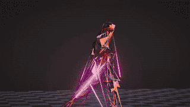
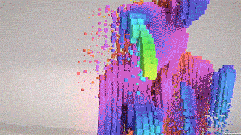
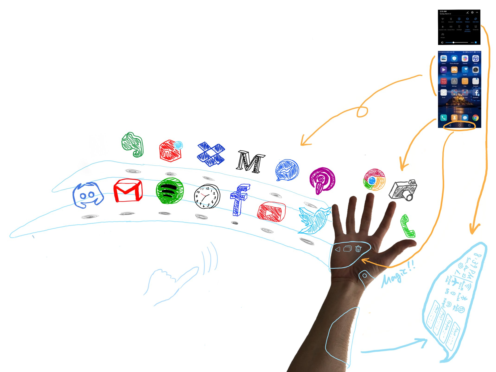
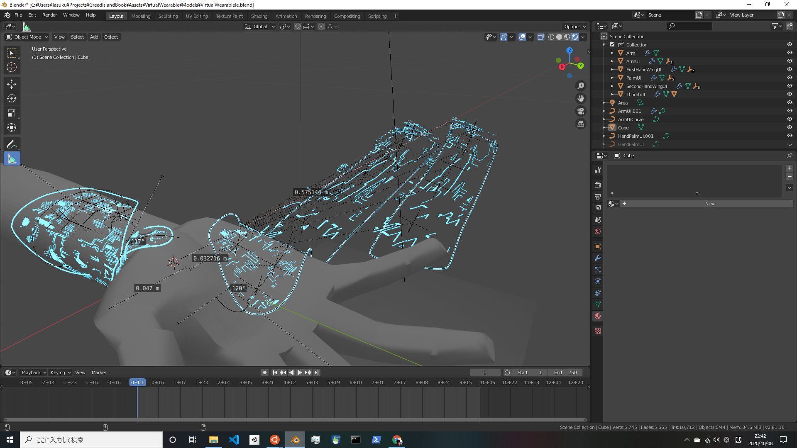
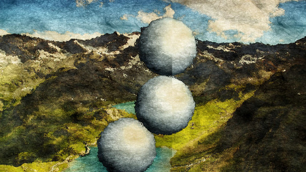

# FutureSketches
The future vfx sketches

## Beginner
### Attractors

## Intermediate
### [Soap Bubbles](https://www.youtube.com/watch?v=Nu8CZciSZt4), [Plexus](https://twitter.com/olmirad/status/1133808769639620609)

### Skinner, Voxel Man

## Advanced
### Fluid simulation & VFX

I will use Graphics buffer & volumetric rendering in real-time.

### Virtual wearable

## Post Processing

